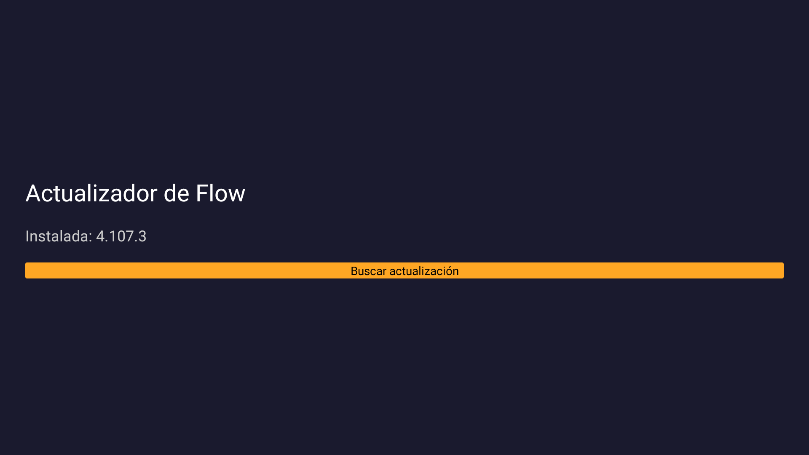

# Actualizar Flow en el Amazon Fire TV Stick (sin Downloader ni instalador de APKs aparte)

Si buscaste **"cómo actualizar Flow en Fire TV Stick"**, **"Flow Fibertel
no actualiza en Amazon Fire TV"** o **"instalar Flow APK en Fire Stick"**,
llegaste al lugar correcto.

Flow (Fibertel/Telecom Argentina) casi nunca aparece en la Amazon Appstore
del Fire TV, así que la única forma de tenerlo actualizado es bajar el APK
a mano de algún sitio, después usar una segunda app para instalarlo, y
repetir todo eso cada vez que sale una versión nueva. **Actualizador de
Flow** hace todo eso con un solo botón: busca la última versión, la baja y
la instala, sin salir de la app.



## Instalar (para cualquiera, no hace falta compu ni saber programar)

1. En el Fire TV Stick, abrí la app **Downloader** (el ícono naranja con
   una flecha). Si no la tenés, buscala como "Downloader" en la Amazon
   Appstore del propio Fire TV — es gratis y la usa mucha gente para bajar
   APKs.
2. En el campo de la URL escribí exactamente esto y confirmá:

   ```
   github.com/entornodigital28/flow-updater-tv/releases/latest/download/ActualizadorDeFlow.apk
   ```

3. Cuando termine de bajar, tocá **Instalar**. Si es la primera vez que
   instalás algo con Downloader, Fire TV te va a pedir permiso para
   "Instalar aplicaciones de fuentes desconocidas" — aceptalo, es normal y
   solo se pide una vez.
4. Listo. Abrí **Actualizador de Flow** desde tus apps.

## Cómo se usa

1. Abrí la app.
2. Tocá **Buscar actualización**.
3. Si hay una versión nueva, aparece **Descargar e instalar** — tocalo y
   esperá (se ve el porcentaje de la descarga). No hay que ir a ninguna
   otra app ni buscar ningún archivo a mano.
4. Cuando termina, el botón pasa a **Abrir aplicación** y entrás directo a
   Flow. Si ya estabas al día, pasa lo mismo: te lleva directo a Flow.

## Preguntas frecuentes

**¿Es gratis?** Sí, y el código es público en este mismo repositorio.

**¿De dónde saca la actualización de Flow?** De
[APKMirror](https://www.apkmirror.com), un sitio conocido de mirrors de
APKs de Android. La app instala la actualización con `PackageInstaller`,
el mismo mecanismo que usa `adb install`: si la firma no coincidiera con
tu Flow instalado, Android directamente rechaza la instalación en vez de
romper nada.

**¿Reemplaza a Downloader?** No del todo: Downloader (o algo parecido)
sigue haciendo falta **una sola vez**, para instalar el propio
Actualizador de Flow. De ahí en adelante, para actualizar Flow ya no hace
falta ni Downloader ni buscar nada a mano.

**¿Funciona en cualquier Fire TV?** Se probó en un Fire TV Stick con Fire
OS actual. Debería andar en cualquier dispositivo Fire TV (Stick, Stick
4K/4K Max, Cube, Lite) con Flow instalado, porque no usa nada específico
de un modelo puntual.

**¿Y si Flow no está instalado todavía?** También sirve: detecta que no
está, y "Descargar e instalar" hace una instalación nueva en vez de una
actualización.

## Para quien quiera compilarla desde el código

Requiere JDK 17 y el Android SDK (`platform-tools`, `platforms;android-33`,
`build-tools;33.0.2`) con `local.properties` apuntando a `sdk.dir`.

```
gradlew.bat assembleDebug
```

El APK queda en `app/build/outputs/apk/debug/app-debug.apk`.

### Instalar por ADB (para desarrollo)

1. Activar depuración ADB: Ajustes → Mi Fire TV/Dispositivo → tocar el
   nombre del build 7 veces → Opciones de desarrollador → Depuración ADB.
2. Anotar la IP en Ajustes → Mi Fire TV → Acerca de → Red.
3. `adb connect <ip>:5555` y aceptar el cartel de autorización en el TV.
4. `adb install -r app/build/outputs/apk/debug/app-debug.apk`.
5. La primera vez, la app va a pedir habilitar "Instalar apps desconocidas"
   para sí misma (Ajustes → Mi Fire TV → Opciones de desarrollador →
   Instalar apps desconocidas → Actualizador de Flow → Activado). Después
   de activarlo, volver a tocar "Descargar e instalar".

## Cómo funciona por dentro

- `ApkMirrorClient.kt`: navega APKMirror con un `WebView` real (con JS) —
  busca la ficha de Flow, lee la versión, y sigue la cadena de descarga
  hasta capturar la URL firmada del archivo final. No usa ninguna API no
  oficial: todo es la misma navegación que haría una persona.
- `ApkInstaller.kt`: el archivo de APKMirror es un `.apkm` (zip con varios
  `.apk` — arquitecturas/idiomas). Se abre el zip y se instalan todas las
  entradas `.apk` en una sola sesión de `PackageInstaller`, igual que hace
  `adb install-multiple`.
- `MainActivity.kt`: la pantalla, la comparación de versión instalada vs.
  disponible, la descarga (con porcentaje), el manejo del permiso de
  "orígenes desconocidos" y el botón "Abrir aplicación" al terminar.

## Descarga: por qué no confía solo en el aviso del sistema

`DownloadManager` avisa que una descarga terminó con el broadcast
`ACTION_DOWNLOAD_COMPLETE`. En pruebas reales, ese aviso **a veces no
llega**: el propio proceso del sistema (`DownloadProvider`) tira una
excepción al intentar indexar el `.apkm` en el `MediaProvider` justo
después de terminar la descarga — se ve en logcat como un crash de
`DownloadProvider.updateMediaProvider` — y esa excepción corta el aviso
antes de que salga. La descarga en sí termina bien; lo que falla es
únicamente la notificación.

Por eso `MainActivity.kt` no depende de ese broadcast para decidir cuándo
instalar: el sondeo que actualiza el porcentaje (`pollDownloadProgress`,
cada 500&nbsp;ms) es el que de verdad detecta el final, consultando el
estado real en `DownloadManager` en vez de esperar a que alguien avise. El
broadcast solo actúa como un empujón extra por si llega antes que el
sondeo — `checkDownloadStatus()` está escrita para poder llamarse desde
cualquiera de los dos caminos sin duplicar la instalación.

## Limitaciones conocidas

- **Scraping frágil por diseño:** APKMirror no tiene API pública. Si cambia
  el HTML de sus páginas, `ApkMirrorClient.kt` es el único lugar que hay
  que revisar. La app nunca falla en silencio: si no puede leer la versión
  o encontrar el siguiente link, lo dice en pantalla.
- **Cloudflare:** en las pruebas no apareció ningún desafío interactivo
  (`ApkMirrorClient` navega con un WebView oculto). Si algún día aparece uno
  para la etapa de descarga, `onChallenge()` es el gancho para mostrar el
  WebView en pantalla y que se resuelva con el control remoto — hoy no hizo
  falta.
- **La firma tiene que coincidir:** si algún día Flow deja de estar en
  APKMirror con la misma firma que la versión instalada (por ejemplo, si
  Telecom empieza a firmar distinto), la instalación va a fallar con un
  error de Android (no de esta app) en vez de actualizar.
